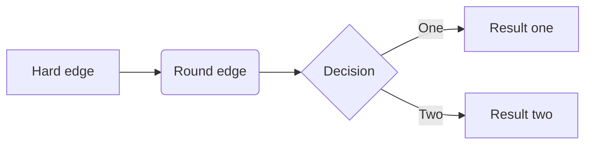
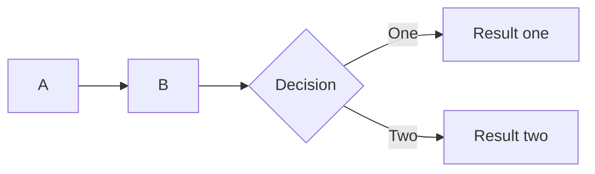
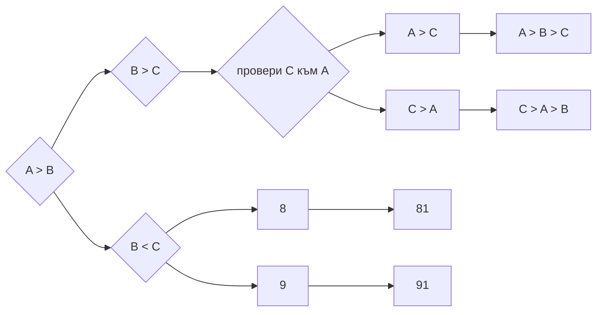

Итерация  (от латински iterare „повтарям“) 


Интерполиращи стрингове 

```javascript
`${varaible1} ${varaible}`
```


Дебъгване


## TEST Flowcharts


https://mermaid-js.github.io/mermaid/#/flowchart

~~~gfm

~~~



test




